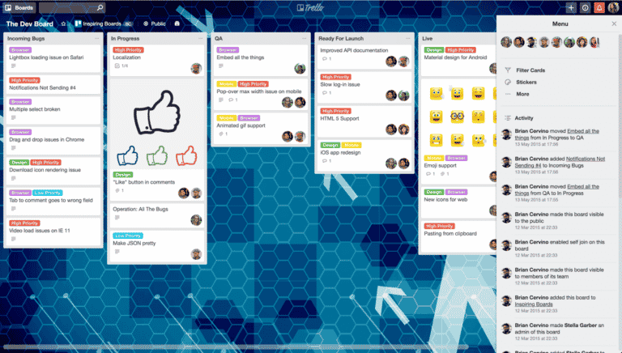
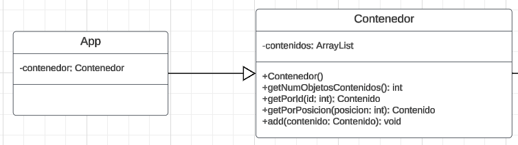
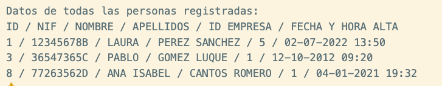
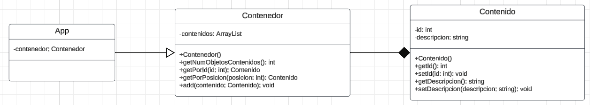
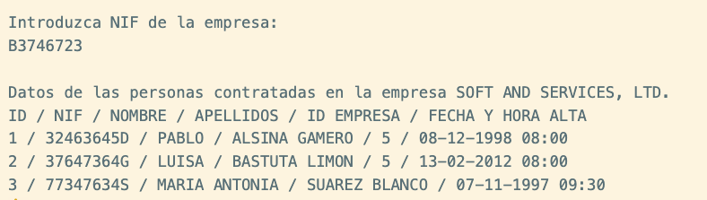
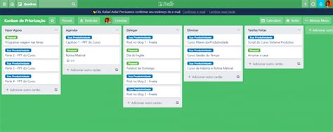

# Prática 5. Creación de una aplicación en Java utilizando Kanban.
## Datos personales del autor
* **Nombre**: Víctor Manuel Rivas Santos.
* **E-mail**: vrivas@ujaen.es
* **Asignatura**: Desarrollo Ágil / Curso 2023-2024 / Grupo A

## Tablero Trello
La dirección del tablero en Trello es: [https://enlace.inventado.trello/b/12239329][url-trello]

Lorem ipsum dolor sit amet, consectetur adipiscing elit, sed do eiusmod tempor (ver [tabla 1](#tabla-listas-wip)) incididunt ut labore et dolore magna aliqua.

<anchor id="tabla-listas-wip"/>

| Lista | WIP |
|-|:-:|
| Una lista | 15 |
| Otra lista | 23 |
| Más listas | 2 |

<titulo>**Tabla 1.** Excepteur sint occaecat cupidatat non proident, sunt in culpa qui officia deserunt mollit anim id est laborum.</titulo>

## Incremento número 1.
Lorem ipsum dolor sit amet, consectetur adipiscing elit, sed do eiusmod tempor incididunt ut labore et dolore magna aliqua. Ut enim ad minim veniam, quis nostrud exercitation ullamco laboris.

### HU seleccionadas para este incremento
Velit esse cillum dolore eu fugiat nulla pariatur:
* F1. Mostrar los datos de todas las personas registradas en el sistema.
* F4. Mostrar todos los datos de todas las personas que están contratadas en una empresa, ordenadas alfabéticamente por apellidos.
* F12. Mostrar los datos de todos los registros horarios que hay en el sistema, ordenados cronológicamente.

Nisi ut aliquip [ilustración 1](#ilustracion-seleccionadas-incr-1) ex ea commodo consequat. Duis aute irure dolor in reprehenderit in voluptate velit esse cillum dolore eu fugiat nulla pariatur.

<anchor id="ilustracion-seleccionadas-incr-1"/>

**Ilustración 1.** Tablero Trello con el conjunto de HU seleccionadas para el incremento 1.

#### Desarrollo de HU F1. Mostrar los datos de todas las personas registradas en el sistema.

Nisi ut aliquip [ilustración 2](#ilustracion-uml-f1) ex ea commodo consequat. Duis aute irure dolor in reprehenderit in voluptate velit esse cillum dolore eu fugiat nulla pariatur.

<anchor id="ilustracion-uml-f1"/>

**Ilustración 2.** Diagrama UML con las clases introducidas para poder desarrollar la HU F1.

Duis aute irure dolor in reprehenderit in voluptate velit esse cillum dolore eu fugiat nulla pariatur. Lorem ipsum dolor sit amet, consectetur adipiscing elit, sed do.

Phasellus rutrum risus sit amet (ver [ilustración 3](#ilustracion-interfaz-f1)) dolor accumsan venenatis ut at nunc. Nunc elit magna, fringilla quis arcu quis, vehicula aliquam risus. Nunc vel porta tellus, a condimentum tortor. Morbi ac tortor est. Duis tincidunt justo non ligula rutrum, ac viverra risus dignissim.

<anchor id="ilustracion-interfaz-f1"/>

**Ilustración 3.** Mockup de la HU F1.

#### Desarrollo de HU F4. Mostrar todos los datos de todas las personas que están contratadas en una empresa, ordenadas alfabéticamente por apellidos.

Nisi ut aliquip aute irure dolor in reprehenderit[ilustración 4](#ilustracion-uml-f4) ex ea commodo consequat. Duis aute irure,  esse cillum dolore eu,  dolor in reprehenderit in voluptate velit esse cillum dolore eu fugiat nulla pariatur.

<anchor id="ilustracion-uml-f4"/>

**Ilustración 4.** Diagrama UML con las nuevas clases necesarias para la HU F4.

Duis aute irure dolor in reprehenderit in voluptate velit esse cillum dolore eu fugiat nulla pariatur. Fringilla quis arcu quis, vehicula aliquam risus.Lorem ipsum dolor sit amet, consectetur adipiscing elit, sed do.

[Ilustración 5](#ilustracion-interfaz-f4) phasellus rutrum risus sit amet (ver ) dolor accumsan venenatis ut at nunc. Nunc elit magna, firure dolor in reprehenderit in voluptate velit e, a condimentum tortor. Morbi ac tortor est. Duis tincidunt justo non ligula rutrum, ac viverra risus dignissim.

<!--
Introduzca NIF de la empresa:
B3746723

Datos de las personas contratadas en la empresa SOFT AND SERVICES, LTD.
ID / NIF / NOMBRE / APELLIDOS / ID EMPRESA / FECHA Y HORA ALTA
1 / 32463645D / PABLO / ALSINA GAMERO / 5 / 08-12-1998 08:00
2 / 37647364G / LUISA / BASTUTA LIMON / 5 / 13-02-2012 08:00
3 / 77347634S / MARIA ANTONIA / SUAREZ BLANCO / 07-11-1997 09:30
-->
<anchor id="ilustracion-interfaz-f4"/>

**Ilustración 5.** Mockup de la HU F4.

#### Estado del tablero Trello tras finalizar el incremento.

Suspendisse ligula nunc, fermentum nec lorem ac, tincidunt finibus est. Cras felis tortor, imperdiet non eros nec, ultricies bibendum libero. Morbi consequat lorem sit amet nunc auctor, vitae unus (puede verse en 
[ilustración 6](#ilustracion-trello-final-incr-1))

<anchor id="ilustracion-trello-final-incr-1"/>

**Ilustración 5.** Estado del tablero Trello al terminar de desarrollar las HU del incremento 1.

<!-- Enlaces --> 
[url-trello]: https://enlace.inventado.trello/b/12239329

<!-- Estilos -->
